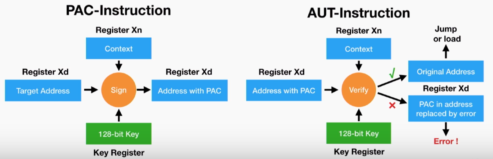

# pac shell

## Category: pwn

### Challenge Setup
This challenge provides a tar file containing the files necessary for a Docker setup. This includes the ARM binary we are trying to pwn and the source code for this binary file. They also give us libc.so.6 and ld-linux-aarch64.so.1, which will be useful for running the challenge and navigating libc later.

Looking at the source code, we see that they print out a variety of ELF addresses, allowing us to calculate the ELF base. We also see that they kindly gave us arbitrary read and write functions. In fact, they also gave us control flow with the small caveat that our address must pass a check by the autiza ARM instruction. So now the question is: how can we bypass this check?

### Autiza and Paciza?!
What even are autiza and paciza? Looking up these instructions, we quickly learn that they are part of the pointer authenitcation code (PAC) instruction family. Specifically, paciza cryptographically signs a given address using key-A and the NULL context, producing a PAC that is inserted into the address from bit 40-54. Then, autiza verifies the PAC for a given address and removes the PAC if it is valid, otherwise is mangles the upper bits of the address, causing a translation fault when the address is used. Therefore, for this challenge, I assumed PAC cannot be broken and must be bypassed in a different way.

For more information on these instructions, I recommend watching the first part of this [DEFCON presentation](https://www.youtube.com/watch?v=DJFxhShJ6Ns&ab_channel=DEFCONConference), which is where I found the picture above.

### Breaking the PAC
To bypass the PAC, we utilize the help() function in the challenge binary. This function parses the builtins struct and computes the PAC for each address provided in the struct. Since builtins is a global variable, we can determine its address from the ELF base and control its content using the arbitrary write functionality. This means we can write any address into builtins and get its PAC as the output. Therefore, we can now run any arbitrary address using the PAC generation technique.

### Pivoting Memory
The next step is to figure out what to run. My first thought was to run a magic gadget to get a shell. I used the [one_gadget](https://github.com/david942j/one_gadget) tool to search for a magic gadget in libc, but came up empty-handed. I then defaulted to manually looking for a magic gadget inside the do_system function of libc. This is where I found that system utilized process_spawn() in place of a fork()-execve() combo. This explains why one_gadget failed to find any magic gadgets. However, due to the large number of arguments that process_spawn() takes, I was not able to find a magic gadget with satisfiable conditions, killing the dream of the magic gadget.

I therefore opted to leak the stack address and perform a classic ROP. I can't help but feel that there is a cleaner way to solve this challenge, but a solve is a solve, and I could use the practice in ARM ROP. 

To leak the stack address, we will perform some memory pivots. Starting with the ELF base address, I calculated the system GOT entry's address and then used the arbitrary read to get the system libc address. I could then calculate the libc base using system's offset into libc. Next, I found the offset of the program name, which is stored on the stack, in libc. Reading this value from libc, gave me a stack address, which I then used to calculate the base of main's stack frame. Now I can start writing to the stack and ROPing.

### ROPing to Win
If we look at main's assembly, we notice that $sp + 0x10 is the only address used while in the infinite while loop. Therefore, we can safely use the rest of the stack without triggering any segfault while setting up our ROP chain, since we must write gadget by gadget using the arbitrary write functionality.

I used the [rp++](https://github.com/0vercl0k/rp) tool to find gadgets in the ELF and then manually looked through to find a gadget that moved a value from the stack into a register (ideally x0). Unfortunately I did not find a useful gadget for x0, but I found one for $x19. 

Next, I needed to find a gadget to mov x0, x19. I had no luck in the ELF, but after searching libc, I found the perfect gadget. 

Chaining these together along with system address, I was able to mov a pointer to "/bin/sh" into x0 and call system, giving me a shell and the flag!
For more details on the implementation, see the attack.py script.

