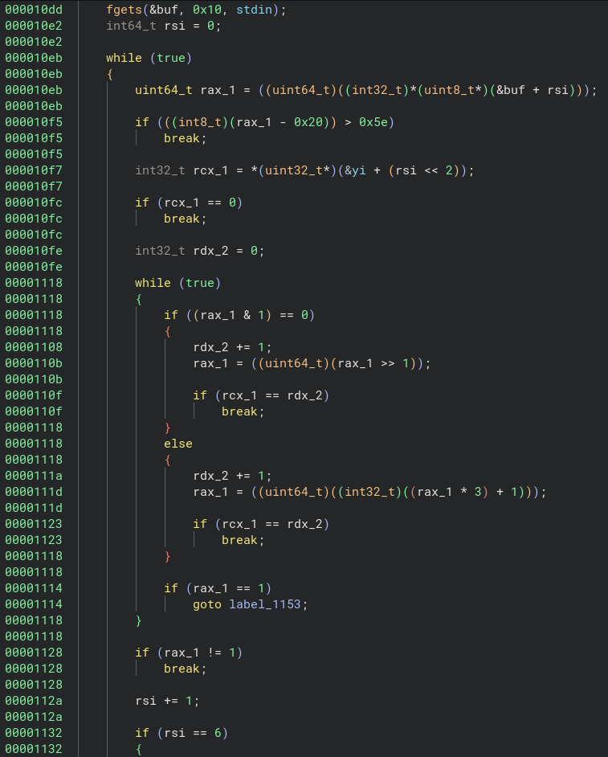
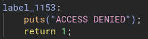
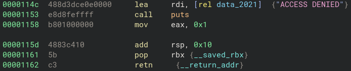
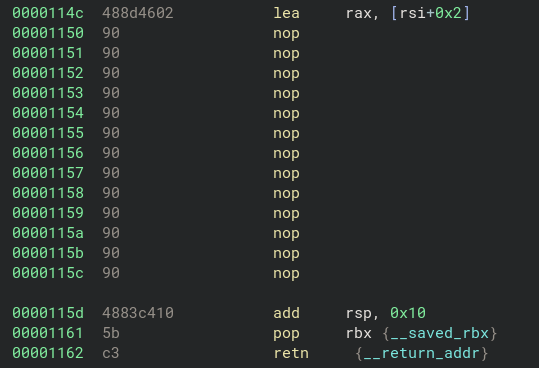

# Category: Reverse Engineering

## Challenge: nine-solves

This challenge gives us a binary (nine-solves), which is linked in the repo, as well as a nc connection.

### Rev?
Running the binary and opening it in binja (my favorite decompiler <3), we see this is a classic rev challenge, where we must figure out the access code and send it to the server to get the flag.



Looking closer at the disassembly, it appears to check character by character for a string of length 6. If a character is valid, it increments the count (rsi) by one until it equals 6. If we believed in reverse engineering, we may try to understand the code and predict each of the characters. However, we can just patch the binary (using my favorite decompiler binja <3) to print out the number of correct characters at the end, allowing us to brute force byte-by-byte.

## Brute Force > Rev
There are lots of way to patch the binary, but as described above, we will print/send some information about the number of character characters. We do this by returning the count variable once the program reaches the end.

Original code:





Patched Code:



With the program patched, we create a simple brute force script that goes byte-by-byte, checking for an increment in the return value. We also account for the final character, which will not fail, by checking for the flag output. In my case, I created a test "flag.txt" containing "test".

### Script:

```
from pwn import *

#initialize things
context.binary = "patched-nine-solves"
context.log_level = "error"
ans = ""

for l in range(6): #byte-by-byte
    #reset
    guess = ""
    test = False
    for i in range(256): #possible byte values
        guess = ans + chr(i)

        #access process
        r = process()
        r.readuntil(b"access code: ")
        r.sendline(guess.encode())
        try:
            out = r.readline()
        except:
            out = b""
        ret_val = r.poll(block=True)
        r.close()

        #
        if b"test" in out or ret_val == (l + 3):
            ans += chr(i)
            test = True
            print(f"code: {ans}")
            break

    if not test:
        print("ERROR")
        break
```

### Win
We run the script, getting the code, and then send the code to the server!

flag: lactf{the_only_valid_solution_is_BigyaP}
