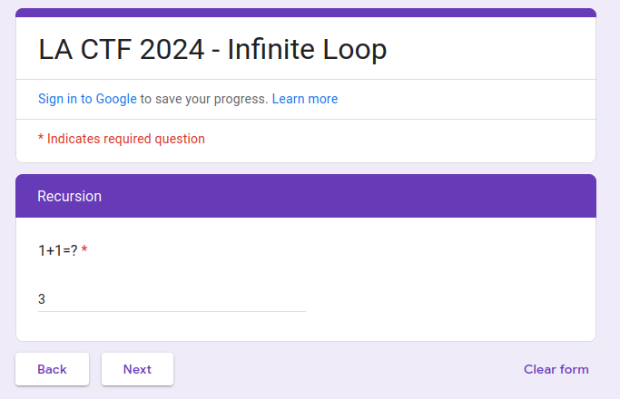
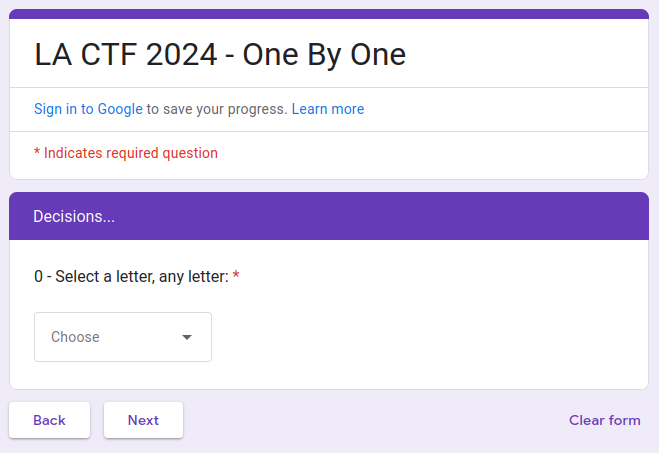
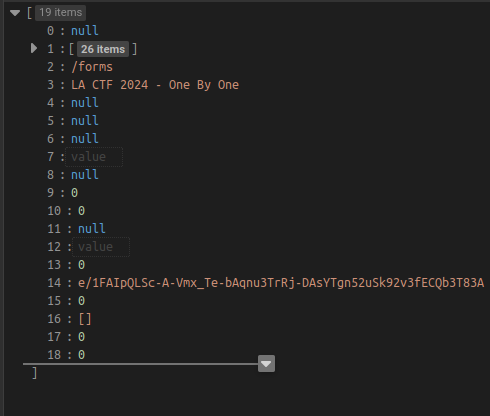
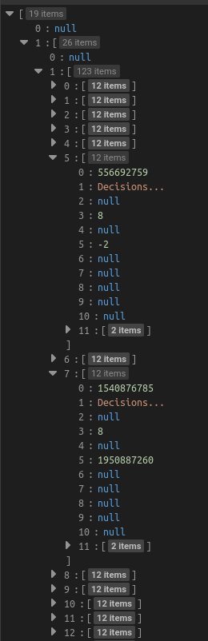
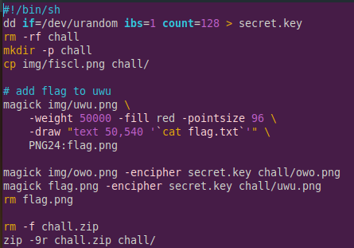
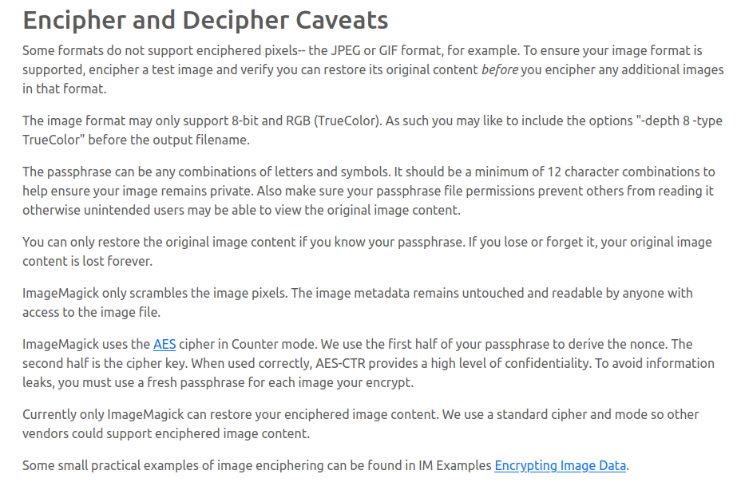

# Category: Misc

## Infinite Loop

This challenge links us to a google [form](https://docs.google.com/forms/d/e/1FAIpQLSfgUDWRzgkSC2pppOx_SVdw1E9bpVVWUkvQssmWza11pufMUQ/viewform?usp=sf_link). If we fill out the form and keep clicking next, we never progress in the form. 

By inspecting the source of the form and searching for "lactf", we find the flag split in two and hidden in the source. By combining the pieces, we get lactf{l34k1ng_4h3_f04mz_s3cr3tz}. I will go into more detail about exactly where the flag was hidden in the next challenge.

## One by one

This challenge links another google [form](https://docs.google.com/forms/d/e/1FAIpQLSc-A-Vmx_Te-bAqnu3TrRj-DAsYTgn52uSk92v3fECQb3T83A/viewform). This time the form asks us for 29 letters, each letter being its own question. 

This hints that the answers to the questions may be the flag, so the first 6 answers are "lactf{". If we click through the questions, we eventually reach a page telling us "that was not the flag," confirming our theory that the answers to the questions are the letters themselves. This also means we will know we got the flag correct once we reach the win screen. If we go back to the variable with JSON formatting, where we found the flag for the previous challenge, we notice a lot of form specific data. I looked up this variable and found a [guide](https://theconfuzedsourcecode.wordpress.com/2019/12/15/programmatically-access-your-complete-google-forms-skeleton/) on how to reverse engineer google forms using this JSON data. I copied the JSON data into a [JSON parser](https://jsoneditoronline.org/) referenced by the guide.

Following the guide and searching through the data, we find that there are two sections per question. If we look closer, we can find that the sections for each question (besides Q0) differ in field 5 of the JSON data.

I am not sure what this field represents, but one value is always -2 "bad" and the other looks like some form of valid ID number "good". I also found that the question choices all have the fourth field set to 0 in the "bad" section, whereas the fourth field appears to be a valid ID in the "good" section. Checking the ID of "l", "a", "c", "t", "f" for their corresponding questions, I found that their ID differed from the IDs of the rest of the answer choices, which all had the same ID.

Therefore, I went section by section and found the answer choice with the unique ID, indicating that it was the next character in the flag. I did this by hand, which took ~10 minutes, but you could also do it using a script. This gave lactf{1_by_0n3_by3_un0_*,"g1'} as the final flag. Entering this in the Google form also gave us the win screen, confirming we are correct.

## gacha

This challenge gave us a setup shell script that took two pictures (one of which contains the flag) and encrypted them with magick (command line utility of ImageMagick) using the same random key. We are given these two encrypted images along with another image of fischl that is unrelated.

I looked up ImageMagick -encipher and found this [doc](https://imagemagick.org/script/cipher.php). 

The doc specifically warns against key reuse and tells us that the encrpytion uses AES-CTR block encryption. I looked up the chaining scheme and found that CTR uses a nonce, counter, and key to basically generate a stream key that is XORed with the plaintext. 

Since the password is used to generate the nonce and key, both images use the same stream key, meaning if we XOR the two encrypted images together, we will get back the two plaintexts XORed together. I performed these operations using this [script](attack.py), giving the following file with a discernible flag.

