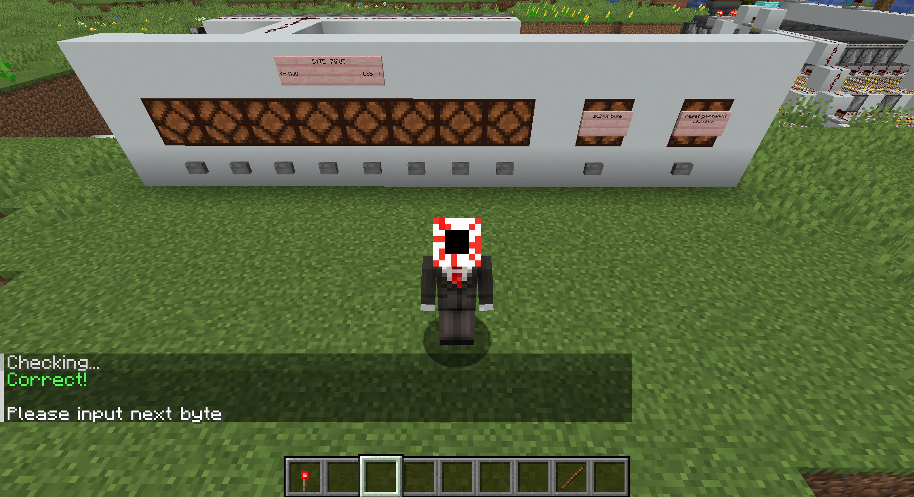
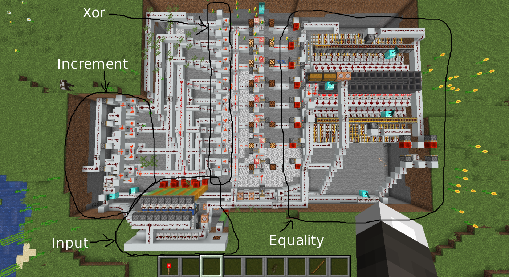

# Challenge: block cipher - misc challenge 

This challenge gives us a zip archive containing a minecraft world.

## MINECRAFT
Of course, the first step is to load this world into minecraft. To do this, I copied the world directory into `~/.minecraft/saves/`. Now, when I open up Minecraft, I see the world in my saved worlds.

Immediately, I see a redstone contraption that takes in a byte of data and checks whether it is correct or not. I double checked that `bctf{` is considered correct, confirming that this machine is checking for the correct flag.

## Redstone > Silicon
The next step is to reverse the redstone digital logic to figure out what is happening. Below is a diagram labeling each of the major sections along with an explanation of the logic for each section.

1. Increment: This redstone logic holds a 4-bit state which increments each time a byte is submitted. This is created by chaining together four 1-bit incrementers where the carry bit increments the next bit over.
 
2. Xor: Since the increment is only 4-bits, we xor the 4-bit increment with both the lower and upper nibble of the input. This is performed with eight 1-bit xor gates.

3. Equality: Finally, the xored output is passed to the equality checker. The equality checker stores the nibbles of the ciphertext in a chest as named concrete blocks (0-f). When the "submit byte" signal is passed, it dispenses two blocks (upper and lower nibbles) from the chest and passes each down a separate chain of deactivated hoppers, which are each filled with a corresponding type of nibble (0-f). The input to the equality checker enables one of the hoppers. Only if the enabled hopper and ciphertext nibble have the same type will the hopper take in the ciphertext block passing a correct signal. If the ciphertext block is not taken in, it will reach the end of the hoppers, falling into lava and setting off an incorrect signal.

## Take me back to the mines
From this it becomes clear the input is being xored with an increment equal to the 0-indexed position of the input byte. It is then checked for equality with the ciphertext. This reduces the problem to a simple xor rev problem. Unfortunately, this means leaving the minecraft world and going back to actual code using a Python script. This is pretty basic. I just copied the ciphertext from the chest into a Script and xored the increment with the ciphertext byte to get back the flag.

It should be noted that the redstone contraption has a lot of documentation in the form of signs, so the challenge is solvable without diving too deep into the redstone digital logic.

`bctf{M1necraft_r3v_b4_GTA6}`
