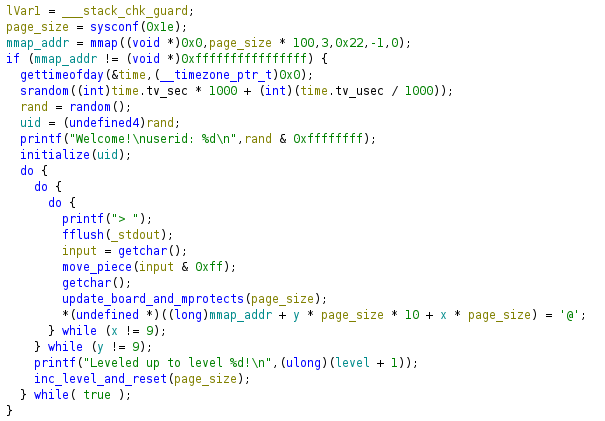
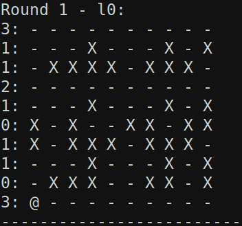

# Challenge: segvroad - reversing

This challenge gives us a stripped aarch64 binary (segvroad), which is provided in the repo, as well as a nc connection. I have also put my solve script in the repo for reference.

## Reversing <3
I won't bore you too much with the reversing process, but generally, I popped the binary into Ghidra (binja free doesn't support aarch64) and broke down the code piece by piece. Below is the annotated decompiled code for main:

I found that the program generates a time seeded random number called the "uid," which then acts as the seed for their PRNG used throughout the program. Since they print out the uid at the beginning of the program, we can always know the state of the process on the server.

Next, we see the program is simulating a "minefield" or "maze" or "frogger" - whichever you want to imagine. The board is a 10x10 grid "randomly" generated using the uid discussed earlier, where each cell is either a 1 (mine) or 0 (safe). We start in the bottom left corner and must move to the top right corner to win a level. We must then repeat this ten times, where the board is regenerated each time, to get the flag. However, each time we move, the board updates according to the rules described below.

After you move and the board updates, the program checks whether you hit a mine or not using a funny method. Separate of the board, there is an mmaped region which acts a 10x10 grid of pages. After each round, the pages are remapped with either no permissions (mine) or rw permission (safe) as decribed by our board. Then, the page corresponding to your new position is dereferenced. If it is a mine, the program will segfault and you lose!

## Defining the Problem
If we look at the board generation and update algo, we see everything is done on a per row basis. In `initialize()`, each row is randomly assigned a "row option" integer in [0, 2] except for the first and last rows which have option 3. These are used to both initialize the rows and also update them after each round

Option 0: Initialized to "random" values and is static (not updated after each round)

Option 1: Initialized to "random" values and is rotated left (if row # is even) and rotated right (if row # is odd)

Option 2: Initialized to all safe cells and when round # % 7 = 3, it is all mines, otherwise it is all safe

Option 3: Initialized to all safe cells and is static. Only the first and last rows are set to this option.

## Recursion go brrrr
After reversing all of this, I realized I wasted a ton of time and should probably just use a recursive search algorithm to find a valid solution. I coded up the board logic into Python (seen in the solve script) and then implemented the algorithm. However, I initially ran into time constraint issues because the recursive tree was just too large. Since the best possible solution uses at least 18 moves, if each node branches on average 3 times, we still need around `3^18 = 387e6` nodes best case scenario. To fix this, I "pruned" my tree using some heuristics. First, I killed the down branch because we are going up not down - NO RETREATING. Second, I added a previous move tracker and made sure to never perform the opposite move (i.e. if prev move is left, don't go right). These guarantee the nodes branch around 2 times. This was sufficient to make the algorithm run in under a couple seconds and win! 

Now we know why the chicken crossed the road: `bctf{to_get_to_the_flag_of_course!bcf77ccc0e23d0bf4fdd903bc008970e}`.
